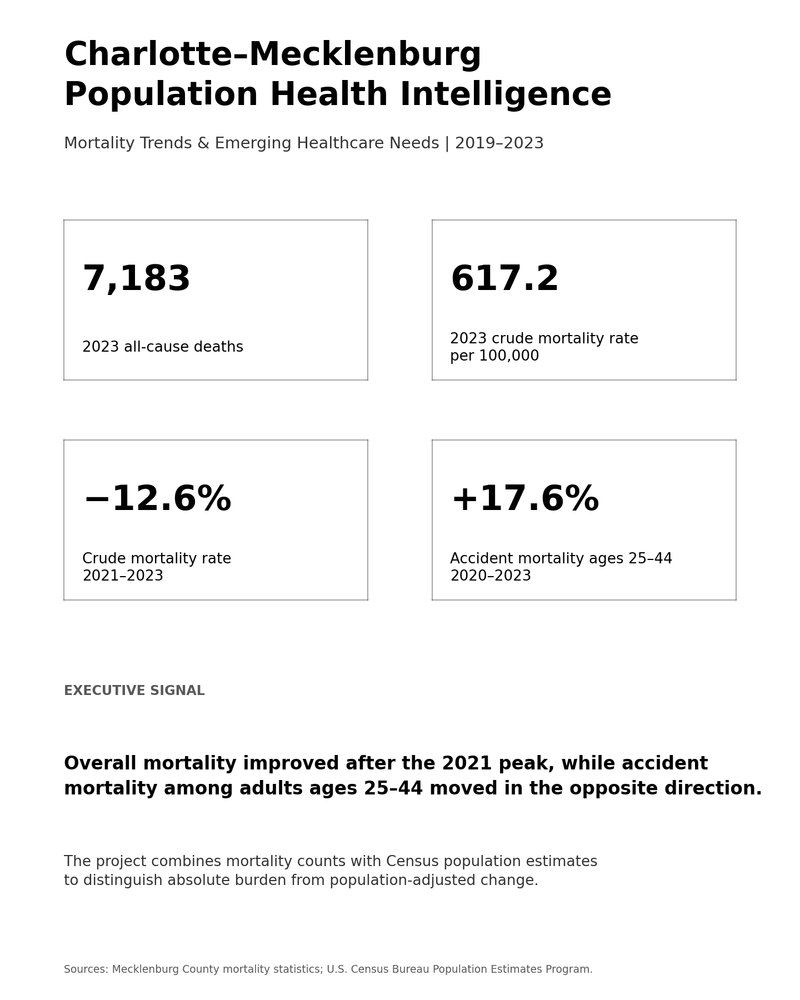
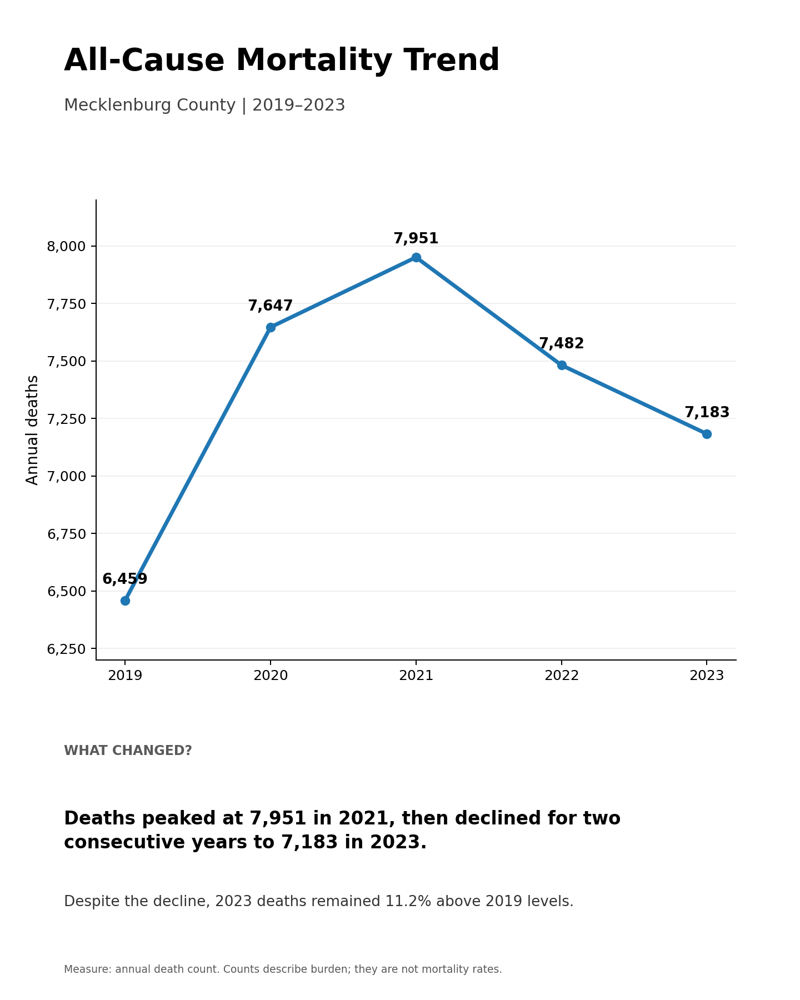
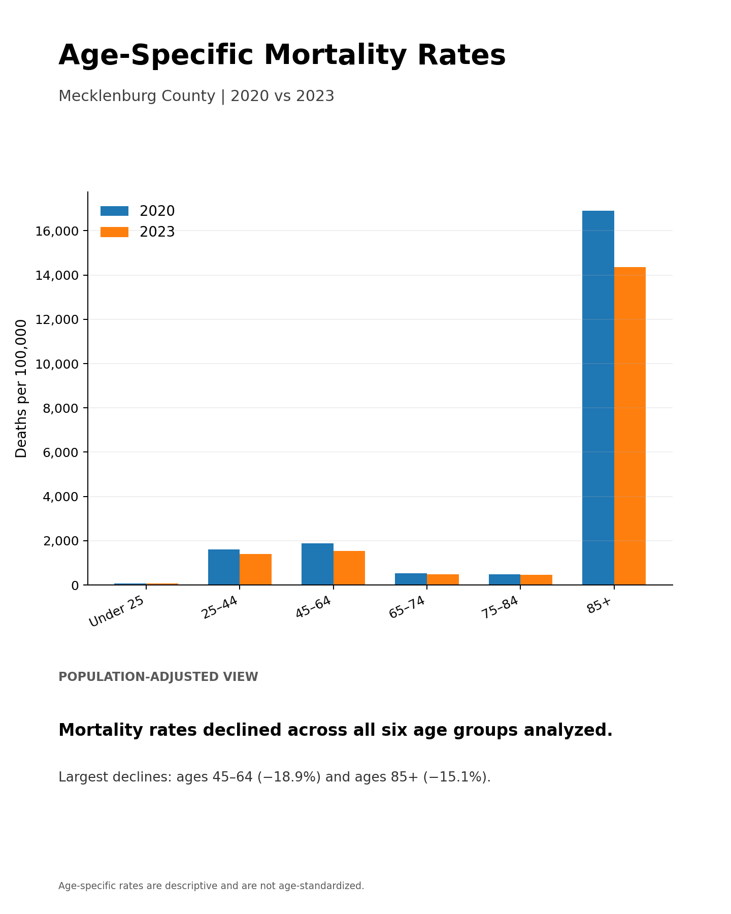
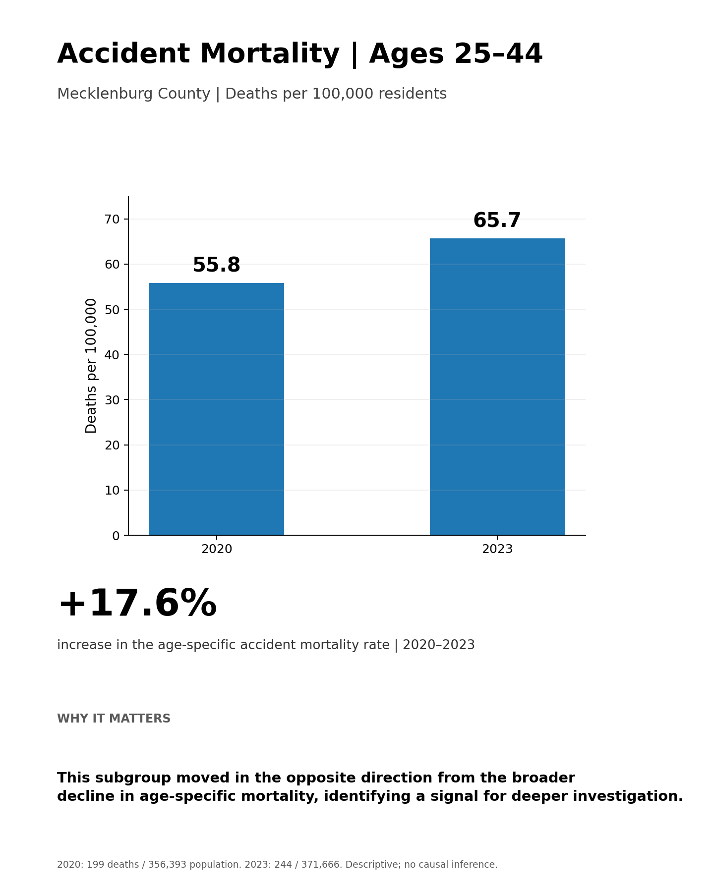

# Charlotte–Mecklenburg Population Health Intelligence

### Mortality Trends, Population Dynamics & Emerging Healthcare Needs | 2019–2023

An end-to-end population-health analytics project examining mortality trends,
age-specific patterns, selected causes of death, and population-adjusted
mortality rates in Mecklenburg County, North Carolina.

**Tools:** Microsoft Excel | Power Query | Data Transformation | Population Health Analytics | Data Visualization

---

## Project Overview

Public-health statistics can describe what happened, but healthcare leaders
often need another layer of analysis:

**What is changing, which populations are affected, and where should we ask
the next question?**

This project transforms Mecklenburg County mortality data into a
decision-oriented population-health intelligence model.

I integrated mortality data from 2019–2023 with U.S. Census Bureau population
estimates to distinguish changes in absolute mortality burden from changes
that remain after accounting for population size and age.

The analysis progresses through four levels:

**Mortality Burden → Cause Patterns → Age Patterns → Population-Adjusted Rates**

---
## Executive Dashboard



---
## Analytical Questions

The project explores four primary questions:

1. How did overall mortality change between 2019 and 2023?
2. Which selected causes of death showed meaningful changes?
3. How did mortality patterns differ across age groups?
4. Did those patterns remain after incorporating population denominators?

---

## Key Findings

### 1. Mortality declined following the 2021 peak

All-cause mortality reached **7,951 deaths in 2021** before declining to
**7,183 deaths in 2023**.

Despite the post-2021 decline, the 2023 death count remained **11.2% above
2019 levels**.



### 2. Population-adjusted analysis strengthened the evidence of improvement

The crude mortality rate declined from approximately **706.0 deaths per
100,000 residents in 2021** to **617.2 per 100,000 in 2023**, a decline of
approximately **12.6%**.

Age-specific mortality rates were also lower in 2023 than in 2020 across
all six analytical age groups.



The largest declines occurred among:

- Ages 45–64: **−18.9%**
- Ages 85+: **−15.1%**
- Ages 25–44: **−11.7%**

### 3. Accident mortality among adults ages 25–44 moved in the opposite direction

This became the project's most important population-health signal.

| Measure | 2020 | 2023 |
|---|---:|---:|
| Accident deaths | 199 | 244 |
| Population | 356,393 | 371,666 |
| Mortality rate per 100K | 55.8 | 65.7 |

**Change in age-specific accident mortality rate: +17.6%**



While broader age-specific mortality declined, accident mortality among
adults ages 25–44 increased after accounting for population growth.

This analysis identifies a signal for further investigation; it does not
establish causality.

---

## Analytical Approach

### Mortality Data

Annual Mecklenburg County mortality datasets from **2019–2023** were
cleaned, standardized, validated, and combined using Power Query.

The analysis included:

- All-cause mortality
- Selected ICD-10 cause categories
- Age-specific mortality
- Cause-by-age analysis

### Population Data

U.S. Census Bureau Population Estimates Program data were incorporated for
**2020–2023**.

Population age categories were transformed and mapped into six consistent
analytical groups:

- Under 25
- 25–44
- 45–64
- 65–74
- 75–84
- 85+

---

## Mortality Rate Methodology

Rates were calculated as:

**Mortality Rate = Deaths / Population × 100,000**

The project uses:

- Crude mortality rates
- Age-specific mortality rates
- Selected cause-specific age mortality rates

Age-specific rates in this project are **not age-standardized mortality rates**.

---

## Data Pipeline

```text
Raw Mortality Data
        ↓
Annual Power Query Transformations
        ↓
Standardized Multi-Year Mortality Dataset
        ↓
Cause + Age Analysis
        ↓
Census Population Data
        ↓
Population Transformation & Age Mapping
        ↓
Mortality + Population Integration
        ↓
Crude / Age-Specific / Cause-Specific Rates
        ↓
Quality Assurance
        ↓
Executive Dashboard
        ↓
Population-Health Intelligence
